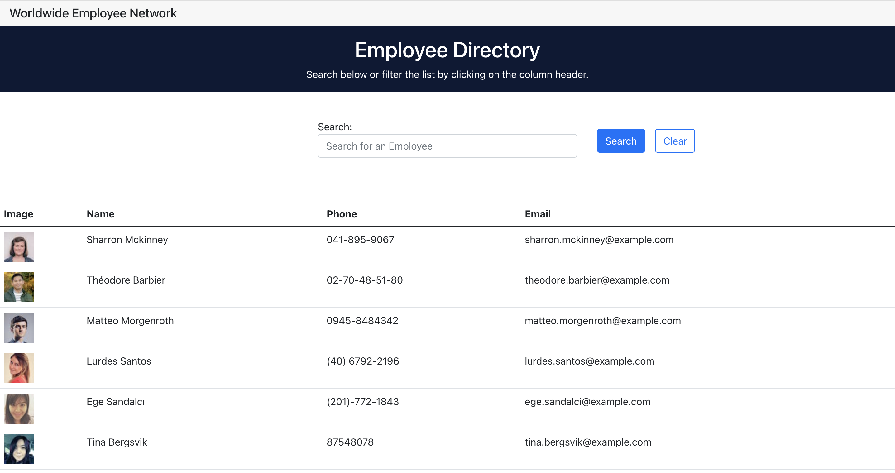

# Employee-Directory_HS
  
## Description
This employee directory features the [Random User API](https://randomuser.me/) is a full stack web app built on React. The UI is comprised of components, responds to user search and clears the search bar.
[GitHub Repo](https://github.com/HannahStarcevich/PWA-Budget-Tracker_HS)
[Live Site on Heroku](https://employee-directory-hs.herokuapp.com/)

## Table of Contents
* [Installation](#installation)
* [Usage](#usage)
* [Contributing](#contributing)
* [License](#license)
        
## Installation
Interacting developers must install utilize React, Heroku, GitHub and install JSON dependencies, including axios to search the API.

## Usage
This application is used by employers and employees to scan a database of employees, search by name and discover contact details. 

        
## Contributing
HannahStarcevich

## License
[MIT](#https://choosealicense.com/licenses/mit/)
